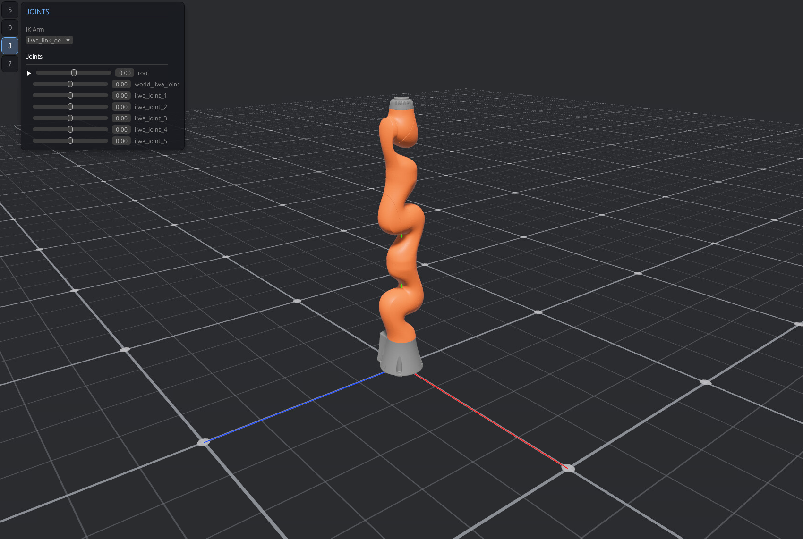

# bevy_urdf

A Bevy-native URDF viewer + IK playground. Load a robot, grab the end-effector, watch the chain follow.



## Run

```
make run                 # launches the viewer with the Franka Panda
make run ROBOT=ur5       # preload a specific catalog entry
```

Catalog covers ~30 robots (arms, mobile bases, humanoids, quadrupeds, grippers). Use the **Browse…** button inside the viewer to load any URDF on disk.

## Controls

| Input | Action |
| --- | --- |
| Left + Right drag | Orbit |
| Middle drag | Pan |
| Scroll | Zoom |
| Shift + Left drag | Drag the IK target |
| Ctrl + Left drag | Nudge the active joint |

## Stack

- [`bevy`](https://bevyengine.org) 0.18 + [`bevy_egui`](https://github.com/vladbat00/bevy_egui) for rendering / UI
- [`urdf-rs`](https://github.com/openrr/urdf-rs) + [`k`](https://github.com/openrr/k) for parsing + kinematics (FK/IK)
- [`rapier3d-urdf`](https://github.com/dimforge/rapier) for optional collider import
- [`big_space`](https://github.com/aevyrie/big_space) floating-origin transforms

URDF meshes live under `urdf/` (not tracked by git — copy in the packages you need).
